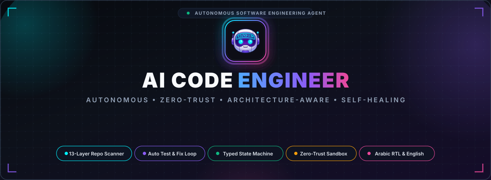
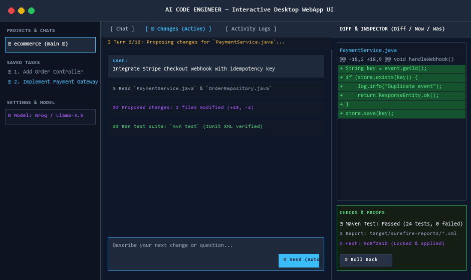

<div align="center">



# AI Code Engineer
### Autonomous, Architecture-Aware, and Zero-Trust AI Coding Agent

<br/>



<br/>

[](LICENSE)
[](https://www.python.org/)
[](https://spring.io/projects/spring-boot)
[]()
[]()
[]()
[](https://github.com/mohamedsaad208/AI-Agent/actions/workflows/ci.yml)
[-EC4899?style=for-the-badge&logo=googletranslate&logoColor=white)]()

<br/>

**AI Code Engineer** is an enterprise-grade autonomous software engineering agent equipped with deep architectural repo-scanning, a deterministic typed state machine, an autonomous build/test/fix repair loop, enterprise-grade zero-trust guardrails, and native bilingual (English & Arabic RTL) support. It runs 100% offline with local Ollama models or seamlessly connects to cloud providers (**Google Gemini**, OpenRouter, OpenAI, Groq, DeepSeek).

<br/>

[Key Highlights](#-key-highlights) •
[Quick Start](#-quick-start) •
[Core Architectural Pillars](#-core-architectural-pillars) •
[Offline Extras & Planning](#-offline-extras) •
[Platform Guide](#-platform-guide) •
[Three Modes & Limits](#-three-modes-and-the-limits-that-go-with-them) •
[Try These First](#-try-these-first) •
[Project Architecture](#-project-architecture) •
[Codebase Map](#-where-everything-lives) •
[Contributing](#-contributing)

</div>

---

# 🚀 Key Highlights

| Capability | What It Delivers |
| :--- | :--- |
| ☕ **13-Layer Spring Boot & Polyglot Scanner** | Deeply inspects enterprise codebases across 13 distinct architectural layers (Controllers, Services, Repositories, Entities, DTOs, Mappers, Security, Configs, Exceptions, Events, Clients, Utils, Tests) with 200+ recognized annotations and inter-class dependency graph resolution. |
| 📋 **Structured Planning & Requirement Grounding** | Validates proposed task steps against real repository symbols, tests, and build facts (`--plan-file`). Rejects hallucinated targets before any code is generated. |
| ⚙️ **Deterministic State Machine (`AgentCore`)** | Replaces unconstrained agent loops with a formally bounded, typed Finite State Machine (`PENDING` ➔ `PLANNING` ➔ `REVIEWING` ➔ `EXECUTING` ➔ `VERIFYING` ➔ `FIXING` ➔ `DONE` / `FAILED`), ensuring full auditability and rollback safety. |
| 🔁 **Self-Healing Build / Test / Fix Loop** | Detects real build toolchains (`Maven`, `Gradle`, `pytest`, `unittest`, `npm`, `cargo`, `go test`), executes tests, parses JUnit XML & terminal failure traces, and autonomously repairs code (bounded to a strict 3-round safety ceiling). |
| 🧠 **Dual-Model Routing & Local Semantic Search** | Routes cheap gathering turns to lightweight models while reserving strong models for planning/repair. Includes offline local vector embeddings via preloaded FastEmbed BGE-small. |
| 🛑 **Instant Task Cancellation** | True real-time task cancellation across Web and Desktop GUI: terminates running process trees cleanly (`kill_tree`) via `taskkill /F /T` on Windows or `kill -9` on Unix, interrupts streaming LLM inference, and safely resets agent readiness. |
| 🔒 **Zero-Trust Security & Enterprise-Grade Guardrails** | Strict filesystem sandbox prevents path-traversal attacks (`..`), symlink escapes, and system device access (`CON`, `NUL`). Automated live regex redactor strips secrets, API keys, PEM private keys, JWTs, and database credentials before model exposure. |
| 🌿 **Non-Destructive Git Checkpoints & Targeted Restore** | Every applied diff commits to a local checkpoint commit (`--no-verify`, skips hooks). If subsequent changes block rollback, Targeted Single-File Git Restore safely restores modified files to the exact pre-task commit without rewriting git history. |
| 🌐 **Native Bilingual Engine & Arabic RTL** | Full first-class Arabic and English dual support. Dynamic Right-to-Left (RTL) interface in the WebApp, automatic language detection (`is_arabic`), and fully localized diagnostic reports and `--arabic` CLI flags. |
| ⚡ **100% Offline & Multi-Provider Cloud** | Full privacy-first execution with local **Ollama** (`qwen2.5-coder`, `deepseek-coder`, `llama3`). Seamlessly switch to cloud models via **Google Gemini** (`gemini-3.8-flash`), **OpenRouter**, **OpenAI**, **Groq**, or custom OpenAI-compatible endpoints. |

---

# ⚡ Quick Start

### 1. Clone & Verify
```bash
git clone https://github.com/mohamedsaad208/AI-Agent.git
cd AI-Agent
```

### 2. Run Diagnostics & First-Time Setup
```bash
# Verify environment readiness, toolchains, and provider reachability
python agent.py setup

# Run self-diagnostics: Python version, Ollama reachability, Docker, env variables
python agent.py doctor

# Run deterministic offline demo — no model, no network, zero repository modifications
python agent.py demo
```

### 3. Run the Test Suite (1,740+ Tests)
```bash
# Run the complete test suite with the standard library test runner:
python -m unittest discover -s tests

# On Windows (pinned against Python 3.11):
run-tests.cmd
```

### 4. Launch the Application
- **Windows:** Double-click `Run-Agent.bat` (or run `python desktop.pyw`)
- **Linux / macOS:** Run `./run-agent.sh` (or `python3 desktop.pyw`)
- **Interactive Terminal Menu:** Run `python launcher.py`
- **Headless Web UI Only:** `python -m ai_code_engineer.webapp --port 8765`

---

# 🏛️ Core Architectural Pillars

### 1. ☕ Enterprise Repository Understanding (`repo_scanner.py`)
Enterprise projects (e.g. Spring Boot microservices, polyglot monorepos) are too large for raw token dump context windows. AI Code Engineer provides an intelligent architectural scanner:
- **13 Specialized Layers:** Automatically identifies and categorizes files into `controllers`, `services`, `repositories`, `entities`, `dtos`, `mappers`, `configs`, `security`, `exceptions`, `events`, `clients`, `utils`, and `tests`.
- **200+ Annotations Recognized:** Detects Spring Boot, Spring Security, Spring Data, Jakarta EE, Lombok, Kafka, RabbitMQ, and Feign annotations (`@RestController`, `@Service`, `@Repository`, `@Entity`, `@Configuration`, `@Transactional`, `@PreAuthorize`, `@KafkaListener`, etc.).
- **Dependency Graph:** Extracts inter-class wiring (`LoginController` ➔ `LoginService` ➔ `CustomerRepository`).
- **`project-index.json`:** Generates and caches structured architecture summaries.
- **Architectural Boosting (`index_boost`):** Directly integrated into `engine.py` to prioritize relevant architectural layers during file candidate selection.

### 2. ⚙️ Deterministic Typed State Machine (`core.py`)
Unlike unpredictable infinite-loop agents, AI Code Engineer is orchestrated by a rigorous, bounded Finite State Machine:
```
           [START]
              │
              ▼
          ┌─────────┐
          │ PENDING │
          └────┬────┘
               │  core.transition_to(PLANNING)
               ▼
          ┌──────────┐
          │ PLANNING │
          └────┬─────┘
               │  core.transition_to(REVIEWING)
               ▼
          ┌───────────┐
          │ REVIEWING │
          └────┬──────┘
               │  core.transition_to(EXECUTING) [User Approves Diff]
               ▼
          ┌───────────┐
          │ EXECUTING │
          └────┬──────┘
               │  core.transition_to(VERIFYING)
               ▼
          ┌───────────┐
          │ VERIFYING │
          └─────┬─────┘
                │
        ┌───────┴───────┐
 (Run Passed)     (Run Failed)
        │               │
        ▼               ▼
   ┌─────────┐    ┌─────────┐
   │  DONE   │    │ FIXING  │◄──┐  (Fix round <= 3)
   └─────────┘    └────┬────┘   │
                       │        │
                       └────────┘
                       │ (Fix rounds exhausted)
                       ▼
                  ┌─────────┐
                  │ FAILED  │
                  └─────────┘
```
- Fully typed data structures: `Task`, `Plan`, `Action`, `Tool`, `Result`, `VerificationResult`, `AgentState`.
- Every transition is validated against `ALLOWED_TRANSITIONS` and logged in state history.

### 3. 🔁 Self-Healing Build / Test / Fix Loop (`repair.py`)
Closing the loop between code generation and execution feedback:
- **Multi-Toolchain Detection:** Automatically invokes project test suites using `mvn test`, `gradle test`, `pytest`, `unittest`, `npm test`, `cargo test`, or `go test`.
- **Typed Verification:** Parses execution status, exit codes, failure counts, and output tails into a `VerificationResult`.
- **Autonomous Repair Iterations:** When tests fail, the agent analyzes compiler diagnostics and assertion errors, proposes targeted diffs, and re-tests up to `MAX_FIX_ROUNDS = 3`.
- **Review-First Invariant:** Autonomous repair diffs are presented for review (or auto-applied only if explicitly enabled per folder).

### 4. 🛑 Instant Task Cancellation
- Real-time cancellation mechanism driven by `threading.Event`.
- Subprocesses are spawned within dedicated process groups. Upon cancellation, `runner.kill_tree()` recursively terminates the entire process tree on both Windows (`taskkill /F /T /PID`) and Unix (`kill -9`).
- Active streaming LLM responses are immediately aborted, freeing GPU and memory resources.

### 5. 🔒 Zero-Trust Security & Enterprise-Grade Guardrails
- **Path Traversal Guards:** Prevents accessing or writing to files outside the workspace root (`..` rejection, symlink escape detection).
- **Windows Device Protection:** Blocks reserved device names (`CON`, `PRN`, `AUX`, `NUL`, `COM1-9`, `LPT1-9`).
- **Secret Redaction:** `redaction.py` strips PEM keys, AWS tokens, GitHub tokens, Slack keys, Google API keys, JWTs, and database passwords from terminal output before sending to the LLM.
- **Protected Policy Files:** Prevents modification of agent policy files (`.cursorrules`, `.github`, `.mvn`, `mcp.json`).

### Folder policy overrides

Show the decisions and safeguards for a project folder:

```bash
agent policy --repo PATH
```

Set a decision for a configurable action class (`write_that_runs`, `execute_custom`, or `network`):

```bash
agent policy --repo PATH --action network --verdict deny
```

Verdicts are `allow`, `ask`, and `deny`. Overrides are stored outside the project in
`.agent-permissions.json` beside the application's own data, so a project change cannot rewrite its
own rules. A missing or unreadable store contributes no overrides; the program uses the built-in
defaults (for example, custom commands and network requests ask). Removing the file therefore removes
the saved overrides and restores those defaults.

Hostnames such as `db.internal` are not resolved during the destination check. Since they could point
to a private service, requests to hostnames require an explicit `network = allow` rule for that folder.
Private and link-local numeric addresses have the same requirement. Do not use that rule for folders
whose code or configuration you do not trust.

---

# 🧠 Offline Extras, Google Gemini & Structured Planning

The latest updates introduce several architectural improvements for speed, reasoning, planning quality, and cloud flexibility:

**Structured Planning & Requirement Grounding (`planning.py`).**
The planning engine now validates proposed tasks against real repository facts. When providing a structured plan via `--plan-file` or the WebApp composer, the agent checks symbol references, test surfaces, and requirement coverage before proposing diffs. This eliminates hallucinations of nonexistent classes or endpoints.

**Google Gemini Provider Integration (`profiles/gemini.toml`).**
Native Google Gemini support is integrated directly via Google AI Studio's OpenAI-compatible endpoint. Features include:
- Automatic prefix stripping (`models/gemini-...` ➔ `gemini-...`).
- Preset profile configured at `profiles/gemini.toml`.
- Preflight cURL generation and diagnostic testing (`agent.py curl --provider gemini --model gemini-3.8-flash --run`).
- Key auto-resolution from `GEMINI_API_KEY` or `GOOGLE_API_KEY`.

**Preloaded Local FastEmbed Semantic Search.**
Local embedding models (`fastembed_bge_small`) are pre-bundled in the `models/` folder for 100% offline semantic retrieval. `symbols.rank` pairs lexical search with vector embeddings cached in `.agent-semantic.json`, ensuring high-precision symbol discovery without network roundtrips.

**Structured Task State & Anti-Loop Streaming Guards.**
The orchestration engine maintains continuity across turns using typed task state (`taskstate.py`). Binding operator constraints are preserved across long-context trimming, while streaming safeguards monitor repetitive token output to prevent generation loops.

**Dual-Model Fast / Strong Routing.**
Profiles can specify distinct `fast_model` and `strong_model` definitions (e.g. lightweight models for mechanical `read_file` or `search_code` operations, reserving stronger reasoning models for diff synthesis, architectural decisions, and repair).

**Optional Local Evals.**
Deterministic eval test suites (`tests/test_improvement_evals.py`) and promptfoo configurations (`tools/eval/promptfooconfig.yaml`) ensure regressions are detected before changes reach production.

[FastEmbed]: https://github.com/qdrant/fastembed

---

# 💻 Platform Guide

| Platform | GUI WebApp Launcher | Interactive CLI Launcher | Direct Terminal Command |
| :--- | :--- | :--- | :--- |
| **🪟 Windows** | Double-click `Run-Agent.bat` | Double-click `Run-Agent-CLI.bat` | `python desktop.pyw` |
| **🐧 Linux** | `./run-agent.sh` | `./run-agent-cli.sh` | `python3 desktop.pyw` |
| **🍎 macOS** | `./run-agent.sh` | `./run-agent-cli.sh` | `python3 desktop.pyw` |

<details>
<summary><strong>🐧 Linux & 🍎 macOS First-Time Setup</strong></summary>

Make the shell launchers executable:
```bash
chmod +x run-agent.sh run-agent-cli.sh
```

Launch the GUI:
```bash
./run-agent.sh
```

Launch the interactive CLI:
```bash
./run-agent-cli.sh
```
</details>

<details>
<summary><strong>⚙️ Scriptable CLI Commands</strong></summary>

```powershell
# Index repository symbols and architectural layers
python agent.py map --repo examples/demo_repo

# Scan Spring Boot or polyglot architecture to project-index.json
python -c "from ai_code_engineer.repo_scanner import RepoScanner; RepoScanner('path/to/project').scan(write=True)"

# Seal a folder as Read-only across all windows and terminals
python agent.py read-only --repo examples/demo_repo
python agent.py read-only --repo examples/demo_repo --off

# Plan and propose code changes using local Ollama
python agent.py plan "Fix add in calculator.py so it adds two numbers" --repo examples/demo_repo --config profiles/local.toml

# Plan with a structured Markdown plan file
python agent.py plan "Implement auth service features" --repo path/to/project --plan-file plan.md --config profiles/gemini.toml --allow-cloud

# Test provider reachability via cURL tool (Google Gemini or Ollama)
python agent.py curl --provider gemini --model gemini-3.8-flash --prompt "Ping" --run

# Review proposed diff
python agent.py review "<session_id>"

# Apply approved proposal (cryptographically verified by SHA-256)
python agent.py apply "<session_id>" --approve "<sha256_hash>"

# Execute automated test suite
python agent.py verify "<session_id>"

# Check status of any session
python agent.py status "<session_id>"

# Export session audit transcript to Markdown or JSON
python agent.py export-session "<session_id>" --format markdown --out session-report.md

# Reopen a declined proposal for review
python agent.py reopen "<session_file>" --approve "<sha256_hash>"

# Rollback changes to pre-task state
python agent.py rollback "<session_id>" --approve "<sha256_hash>"
```
</details>

---

# 🧭 Three modes, and the limits that go with them

The three operating modes are **Chat**, **Read-only**, and **Change**:
- **Chat:** Answers questions in natural prose; reads workspace files as context; writes zero files.
- **Read-only:** Formally seals the workspace folder: reads, searches, and maps symbols, but promises never to propose or write diffs.
- **Change:** Produces cryptographic `SHA-256` diff proposals that you explicitly inspect and approve before anything is written to disk.
- **Auto-Apply:** An optional per-folder switch. Automatically writes proposals without individual clicks, runs tests immediately afterwards, and retains rollback capability.

| Safety Guarantee | Implementation Details |
| :--- | :--- |
| **Project Commands Run with Your Permissions** | Running `mvn`, `gradle`, `npm`, `pytest`, `cargo`, `go` executes real project scripts. The tool uses a strict command allowlist and strips credentials from the environment. |
| **Optional Pinned Docker Sandbox** | Enable `Run in Docker` to execute commands inside an isolated container with a read-only root, no network access, and an image pinned by `sha256` digest. |
| **Tamper-Evident Overrides** | Runtime settings in `.agent-overrides.json` are cryptographically signed. Manually altered, deleted, or unverified configuration rows are detected and rejected. |
| **Cloud Disclosures & Memory-Only Keys** | Cloud endpoints require explicit per-task user approval. API keys are kept strictly in ephemeral memory and are never written to logs, disk, or error messages. |

---

# 🎯 Try These First

- **Spring Boot Architecture Mapping:**  
  *"Scan this microservice repository, generate `project-index.json`, and list all Controllers with their injected Services and Repositories."*

- **Fix a Failing Test with Autonomous Repair:**  
  *"Inspect the failing test in `src/test/java/.../AuthServiceTest.java`. Fix the JWT signature validation, and run `mvn test` until all tests pass."*

- **Bounded Multi-Step Plan:**  
  Attach a `plan.md` file using the **+ Plan** button in the WebApp:  
  *"Implement Step 1 from the attached plan only. Create the missing DTO classes and verify syntax."*

- **Autonomous Self-Healing Loop:**  
  Click **Run & Fix** on the Checks card to let the agent run the test suite, read compiler diagnostics, and iterate on code until all checks turn green.

---

# 🏗️ Project Architecture

```
                                  +-----------------------------------------------+
                                  |    Desktop WebApp / Tkinter GUI / CLI Menu    |
                                  +-----------------------------------------------+
                                                          │
                                                          ▼
+───────────────────────────────────────────────────────────────────────────────────────────────────────────────────+
│                                            Agent Orchestration Engine                                             │
│  - AgentCore State Machine (FSM)               - RepoScanner (13 Architectural Layers & Annotation Index)         │
│  - Task Planner & Queue Manager                - Architecture-Aware File Selection (index_boost)                  │
│  - Instant Cancellation (Process Tree Kill)    - Step-by-Step Planbook Ledger & Progress Tracker                  │
+───────────────────────────────────────────────────────────────────────────────────────────────────────────────────+
                 │                                                                │
                 ▼                                                                ▼
+─────────────────────────────────+                             +───────────────────────────────────+
│         Model Providers         │                             │       Workspace & Security        │
│  - Ollama (Local CPU/GPU)       │                             │  - Path Traversal Guard (..)      │
│  - OpenRouter / DeepSeek        │                             │  - Zero-Trust Secret Redactor     │
+─────────────────────────────────+                             +───────────────────────────────────+
│         Model Providers         │                             │       Workspace & Security        │
│  - Ollama (Local CPU/GPU)       │                             │  - Path Traversal Guard (..)      │
│  - Google Gemini (AI Studio)    │                             │  - Zero-Trust Secret Redactor     │
│  - OpenRouter / DeepSeek        │                             │  - SHA-256 Hash-Locked Diffs      │
│  - OpenAI / Groq / Custom HTTP  │                             │  - Task State Continuity Guards   │
+─────────────────────────────────+                             +───────────────────────────────────+
                                                                                  │
                                                                                  ▼
                                                                +───────────────────────────────────+
                                                                │       Verification & Checks       │
                                                                │  - Toolchain Detectors (Maven,…)  │
                                                                │  - JUnit XML Evidence Parser      │
                                                                │  - 3-Round Autonomous Repair Loop │
                                                                │  - Optional Docker Sandbox        │
                                                                +───────────────────────────────────+
```

---

# 📁 Where everything lives

| Path | Purpose |
| :--- | :--- |
| `src/ai_code_engineer/core.py` | **AgentCore State Machine:** Typed dataclasses (`Task`, `Plan`, `Action`, `AgentState`, `VerificationResult`) and deterministic transition engine. |
| `src/ai_code_engineer/planning.py` | **Structured Planning & Requirement Grounding:** Validates task proposals against real symbols, tests, and build facts. |
| `src/ai_code_engineer/taskstate.py` | **Task State Continuity:** Bounded session continuity ledger, user binding constraints, and streaming anti-loop guards. |
| `src/ai_code_engineer/semantic.py` | **Local Offline Semantic Search:** FastEmbed vector retrieval and `.agent-semantic.json` embedding cache. |
| `src/ai_code_engineer/repo_scanner.py` | **Architectural Repository Scanner:** 13-layer parser, 200+ annotation detectors, dependency graph extractor, `project-index.json`, and `index_boost`. |
| `src/ai_code_engineer/repair.py` | **Autonomous Repair Loop:** `execute_verification`, `verification_from_run`, `handle_fix_evaluation`, and bounded 3-round repair logic. |
| `src/ai_code_engineer/engine.py` | **Core Orchestration Loop:** Planning, diff creation, architecture-boosted context selection, and session persistence. |
| `src/ai_code_engineer/runner.py` | **Command Execution & Sandbox:** Safe process spawning, real-time log streaming, instant cancellation (`kill_tree`), and Docker container isolation. |
| `src/ai_code_engineer/workspace.py` | **Filesystem Sandbox:** Path traversal prevention, symlink protection, Windows device name defense, and rollback managers. |
| `src/ai_code_engineer/redaction.py` | **Zero-Trust Secret Redaction:** Real-time scrubbing of API keys, PEM private keys, JWT tokens, and connection strings. |
| `src/ai_code_engineer/webapp/` | **Desktop WebApp:** Loopback server (`server.py`), state controller (`controller.py`), project manager (`projects.py`), and modern CSS/JS client. |
| `src/ai_code_engineer/gui.py` | **Native Desktop Tk GUI:** Lightweight Python Tkinter desktop client sharing the same engine and sentences. |
| `models/` | **Preloaded Offline Embedding Models:** Local FastEmbed BGE-small ONNX models and tokenizer configs. |
| `tests/` | **1,740+ Automated Tests:** Extensive unit and integration test coverage across all features, state machine transitions, scanner layers, and repair loops. |
| `agent.py` · `desktop.pyw` · `launcher.py` | **System Launchers:** CLI entry point, desktop window entry, and interactive terminal menu. |
| `profiles/` | **Model Profiles:** TOML configuration presets for local Ollama, Google Gemini (`gemini.toml`), and cloud providers. |
| `assets/` | **Brand Assets:** Vector banner with official logo (`banner.svg`), logo assets (`logo.png`), and UI demo animations. |

---

# 🤝 Contributing

We welcome contributions from the global software engineering community!

1. **Fork** the repository.
2. **Create your feature branch:**
   ```bash
   git checkout -b feature/amazing-feature
   ```
3. **Verify all tests pass:**
   ```bash
   python -m unittest discover -s tests -v
   ```
4. **Commit your changes:**
   ```bash
   git commit -m "feat: add amazing new feature"
   ```
5. **Push to your fork and submit a Pull Request (PR).**

---

# 📄 License

This project is open-source software licensed under the [MIT License](LICENSE).
