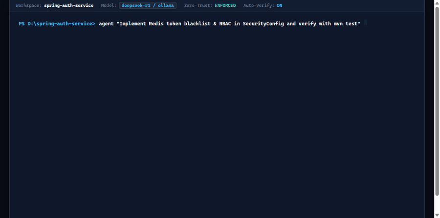

<div align="center">


# AI Code Engineer
### Autonomous, Architecture-Aware, and Zero-Trust AI Coding Agent

<br/>


<br/>

[](LICENSE)
[](https://www.python.org/)
[](https://spring.io/projects/spring-boot)
[]()
[]()
[]()
[](https://github.com/mohamedsaad208/AI-Agent/actions/workflows/ci.yml)
[-EC4899?style=for-the-badge&logo=googletranslate&logoColor=white)]()

<br/>

**AI Code Engineer** is an enterprise-grade autonomous software engineering platform. Built with strict zero-trust guardrails, a deterministic Finite State Machine, and an offline-first philosophy, it pairs deep 13-layer architectural repository analysis with a self-healing build/test/fix repair loop. It works 100% offline with local Ollama models or seamlessly connects to cloud providers (**Google Gemini**, OVH, LLM7, OpenRouter, OpenAI, Groq, DeepSeek).

<br/>

[Key Highlights](#-key-highlights) •
[Quick Start](#-quick-start) •
[Core Architectural Pillars](#-core-architectural-pillars) •
[Unified Commands & CLI](#-12-unified-commands--terminal-power) •
[Web & Desktop UX](#-web-app--visual-experience) •
[Offline Extras & Model Gateway](#-offline-extras-model-gateway--planning) •
[Platform Guide](#-platform-guide) •
[Three Modes & Limits](#-three-modes-and-the-limits-that-go-with-them) •
[Project Architecture](#-project-architecture) •
[Codebase Map](#-where-everything-lives) •
[Contributing](#-contributing)

</div>

---

# 🚀 Key Highlights

| Capability | What It Delivers |
| :--- | :--- |
| ☕ **13-Layer Spring Boot & Polyglot Scanner** | Deeply inspects enterprise codebases across 13 distinct architectural layers (Controllers, Services, Repositories, Entities, DTOs, Mappers, Security, Configs, Exceptions, Events, Clients, Utils, Tests) with 200+ recognized annotations and inter-class dependency graph extraction. |
| 🕸️ **Directed Code Graph & Blast Radius Analysis** | Builds an in-memory directed graph of classes, methods, endpoints, and tests (`code_graph.py`). Calculates exact impact and blast radius before any file change is synthesized. |
| ⚙️ **Deterministic FSM & Typed Tool Contracts** | Governed by a bounded Finite State Machine (`PENDING` ➔ `PLANNING` ➔ `REVIEWING` ➔ `EXECUTING` ➔ `VERIFYING` ➔ `FIXING` ➔ `DONE` / `FAILED`). Every tool call adheres to typed contracts with strict input/output schemas and execution bounds (`contracts.py`). |
| 🛡️ **Zero-Trust Security Gate & MCP Integration** | Every tool invocation passes through a single admission gate (`gate.py`, `policy_engine.py`) with fail-closed policies and single-use TTL approval tokens. Integrates external Model Context Protocol servers (`.agent-mcp.json`) under identical strict guardrails. |
| 🛑 **Prompt Injection & Data Exfiltration Defense** | Enforces an uncompromised instruction trust hierarchy (`SYSTEM` > `USER` > `REPO`). Neutralizes prompt injection patterns and wraps untrusted repository text in structured envelopes (`trust.py`). |
| 🔁 **Self-Healing Build / Test / Fix Loop** | Detects project toolchains (`Maven`, `Gradle`, `pytest`, `unittest`, `npm`, `cargo`, `go test`), parses test output and JUnit XML, and autonomously diagnoses failures across a bounded 3-round repair loop with built-in stagnation detection (`repair_loop.py`). |
| 🧠 **Dual-Tier Persistent Memory & Compass** | Maintains durable project-level (`.agent/memory/project.md`) and session-level (`.agent/memory/chats/`) memory. Automatically injects a bounded 1,500-token Compass into system prompts to preserve project goals, binding constraints, and key decisions across sessions. |
| 🧭 **Plan Mode (`--plan`) & Mid-Run Steering** | Inspect goals, affected files, risk ratings, and test strategies prior to code generation. Dynamically inject guidance mid-run (`steer <instruction>`) to adjust agent direction without aborting execution. |
| 📋 **12 Unified Interactive Commands** | A uniform command vocabulary (`status`, `plan`, `changes`, `diff`, `tests`, `risks`, `stop`, `steer`, `report`, `undo`, `memory`, `help`) shared identically across the Rich CLI and the Web UI. |
| 🌿 **Non-Destructive Git Worktree Safety** | Segregates agent modifications from pre-existing human edits. Targeted single-file restore reverts agent actions to pre-task commit state without touching uncommitted developer work or rewriting history. Hardcoded denial of destructive force pushes. |
| 🌐 **Native Bilingual Engine & Arabic RTL** | First-class English and Arabic dual support with automatic language detection (`is_arabic`), dynamic Right-to-Left (RTL) interface styling, and fully localized diagnostic reports and CLI banners. |
| ⚡ **100% Offline-First & Multi-Provider Gateway** | Complete privacy-first offline execution with local **Ollama** (`qwen2.5-coder`, `deepseek-coder`, `llama3`). Seamless multi-cloud gateway for **Google Gemini** (`gemini-3.8-flash`), **OVH**, **LLM7**, **OpenRouter**, **OpenAI**, **Groq**, and **DeepSeek** with automatic fallback. |

---

# ⚡ Quick Start

### 1. Clone & Verify
```bash
git clone https://github.com/mohamedsaad208/AI-Agent.git
cd AI-Agent
```

### 2. Run Diagnostics & First-Time Setup
```bash
# Verify environment readiness, toolchains, and provider reachability
python agent.py setup

# Run self-diagnostics: Python version, Ollama reachability, Docker, environment variables
python agent.py doctor

# Run deterministic offline demo — no model, no network, zero repository modifications
python agent.py demo
```

### 3. Run the Automated Test Suite (3,100+ Tests)
```bash
# Run the complete test suite with the standard library test runner:
python -m unittest discover -s tests

# On Windows:
run-tests.cmd
```

### 4. Launch the Application
- **Desktop WebApp:** Double-click `Run-Agent.bat` (or run `python desktop.pyw`)
- **Linux / macOS WebApp:** Run `./run-agent.sh` (or `python3 desktop.pyw`)
- **Interactive Terminal Menu:** Run `python launcher.py`
- **Headless Web UI Only:** `python -m ai_code_engineer.webapp --port 8765`
- **Direct CLI Task Execution:** `python agent.py "Fix bug in auth service" --repo /path/to/project`

---

# 🏛️ Core Architectural Pillars

### 1. ☕ Enterprise Repository Understanding & Directed Code Graph (`repo_scanner.py`, `code_graph.py`)
Enterprise codebases cannot be dumped raw into model context windows. AI Code Engineer incorporates an intelligent multi-layer analyzer:
- **13 Specialized Layers:** Automatically identifies and categorizes files into `controllers`, `services`, `repositories`, `entities`, `dtos`, `mappers`, `configs`, `security`, `exceptions`, `events`, `clients`, `utils`, and `tests`.
- **200+ Annotations Recognized:** Detects Spring Boot, Spring Security, Spring Data, Jakarta EE, Lombok, Kafka, RabbitMQ, and Feign annotations (`@RestController`, `@Service`, `@Repository`, `@Entity`, `@Configuration`, `@Transactional`, `@PreAuthorize`, `@KafkaListener`, etc.).
- **Directed Code Graph:** Constructs caller/callee trees, interface implementation maps, and dependency graphs (`code_graph.py`).
- **Blast Radius & Impact Analysis:** Computes the ripple effect of modified symbols across the repository before applying diffs.
- **Architectural Boosting (`index_boost`):** Integrates directly into retrieval to prioritize relevant architectural layers during file candidate selection.

### 2. ⚙️ Deterministic Typed State Machine & Strict Tool Contracts (`core.py`, `contracts.py`)
Replaces unconstrained infinite agent loops with a formally bounded, typed Finite State Machine:
```
           [START]
              │
              ▼
          ┌─────────┐
          │ PENDING │
          └────┬────┘
               │  core.transition_to(PLANNING)
               ▼
          ┌──────────┐
          │ PLANNING │ ◄── [Mid-Run Steering: steer <instruction>]
          └────┬─────┘
               │  core.transition_to(REVIEWING)
               ▼
          ┌───────────┐
          │ REVIEWING │ ◄── [User Approves: [y] approve / [n] reject / [d] details]
          └────┬──────┘
               │  core.transition_to(EXECUTING)
               ▼
          ┌───────────┐
          │ EXECUTING │
          └────┬──────┘
               │  core.transition_to(VERIFYING)
               ▼
          ┌───────────┐
          │ VERIFYING │
          └─────┬─────┘
                │
        ┌───────┴───────┐
 (Checks Passed)  (Checks Failed)
        │               │
        ▼               ▼
   ┌─────────┐    ┌─────────┐
   │  DONE   │    │ FIXING  │◄──┐  (Fix round <= 3 & Stagnation Check Passed)
   └─────────┘    └────┬────┘   │
                       │        │
                       └────────┘
                       │ (Fix rounds exhausted or stagnation detected)
                       ▼
                  ┌─────────┐
                  │ FAILED  │
                  └─────────┘
```
- **Strict Tool Contracts:** Every tool call (`contracts.py`) validates typed parameters against declared schemas, enforces monotonic timeout budgets, and filters out extraneous scratchpad thoughts.
- Every state transition is validated against `ALLOWED_TRANSITIONS` and recorded in immutable history.

### 3. 🛡️ Zero-Trust Security Gate, Policy Engine & External MCP (`gate.py`, `policy_engine.py`, `mcp.py`)
Security is not an afterthought; it is enforced before any action executes:
- **Unified Admission Gate (`gate.py`):** One centralized checkpoint evaluating tool signature, policy classification, running posture, and origin provenance.
- **Action Risk Classification:** Actions categorized into `SAFE_READ`, `READ`, `WRITE`, `EXECUTE_RECIPE`, `EXECUTE_CUSTOM`, `NETWORK`, and `DESTRUCTIVE`.
- **Single-Use TTL Approval Tokens:** Sensitive operations issue cryptographically random approval tokens with short expiration times to prevent replay attacks.
- **External Tools via MCP (`mcp.py`):** Connect external tools via Model Context Protocol servers in `.agent-mcp.json`. MCP tools run namespaced (`mcp_<server>_<tool>`), bounded by operator-defined maximum side-effect ceilings (`read`, `write`, `execute`).
- **Prompt Injection Defense (`trust.py`):** Treats repository data, git logs, and tool stdout as untrusted *DATA*. Strips hidden prompt injection triggers before sending payloads to LLMs.
- **Filesystem Sandbox (`workspace.py`):** Rejects path traversal (`..`), symlink escapes, and Windows reserved device names (`CON`, `PRN`, `AUX`, `NUL`, `COM1-9`, `LPT1-9`).
- **Zero-Trust Secret Redactor (`redaction.py`):** Strips API keys, PEM private keys, JWTs, AWS credentials, and database passwords from all payloads, terminal logs, and session records.

### 4. 🔁 Self-Healing Build / Test / Fix Loop (`repair_loop.py`, `repair.py`)

<br/>



<br/>

Closes the loop between code generation and compiler/runtime feedback:
- **Multi-Toolchain Detection:** Discovers and runs test suites using `mvn test`, `gradle test`, `pytest`, `unittest`, `npm test`, `cargo test`, or `go test`.
- **Diagnostic Analysis:** Parses compiler errors, stack traces, and JUnit XML test reports to pinpoint root causes (Compilation vs Assertion vs Environment).
- **Stagnation Detection:** Halts immediately if consecutive repair iterations produce identical failure signatures, preventing endless token waste.
- **Bounded Safety Ceiling:** Strict maximum limit of 3 autonomous fix rounds (`MAX_FIX_ROUNDS = 3`).

### 5. 🧠 Dual-Tier Persistent Memory & Model Compass (`memory_store.py`, `compass.py`)
Enables cross-session continuity without context pollution:
- **Two-Tier Storage:**
  - **Project Memory (`.agent/memory/project.md`):** High-level project architecture, established design patterns, permanent constraints, and user preferences.
  - **Chat Memory (`.agent/memory/chats/<chat_id>.md`):** Session-scoped task decisions, files inspected, and work completed.
- **The Compass (`compass.py`):** Synthesizes a compact, structured account (capped at 1,500 tokens) injected into system prompts. Guides the model on project identity while treating memory strictly as an informative record, preventing memory-based prompt manipulation.
- **Project Goal Protection:** Project goals cannot be overwritten by agent inference without explicit human confirmation.

### 6. 🛑 Instant Task Cancellation & Process Tree Termination
- Real-time cancellation powered by `threading.Event` and thread-safe cancellation tokens (`governance.py`).
- Subprocesses run inside dedicated process groups. Cancellation triggers `runner.kill_tree()`, terminating processes recursively on Windows (`taskkill /F /T /PID`) and Unix (`kill -9`).
- Streaming LLM inference cancels immediately, conserving GPU memory and network resources.

### 7. 🔍 Smart Code Review & Safety Audit (`smart_review.py`)
Built-in automated engineering review pipeline:
- **Intelligent Test Selection:** Matches modified files to relevant test suites via AST symbol and token overlap.
- **Assertion Tampering Detector:** Flags any attempt to "pass" tests by deleting assertions or disabling test annotations (`@Disabled`, `@Ignore`).
- **AST Security Scanner:** Scans diffs for SQL injection, unsanitized command execution, hardcoded tokens, and insecure deserialization.
- **Senior PR Review Package:** Generates production-grade pull request reviews evaluating correctness, test coverage, and backward compatibility.

---

# 📋 12 Unified Commands & Terminal Power

Every interface (Rich CLI, Web UI, Scripted API) speaks the exact same 12 interactive commands:

| Command | Syntax / Usage | What It Does |
| :--- | :--- | :--- |
| **`status`** | `status` | Where this session stands: current state machine phase, active task, and waiting steps. |
| **`plan`** | `plan` | Read-only view of the plan: Goal, Affected Files, Steps, Risks, and Test Strategy. |
| **`changes`** | `changes` | Clean per-file summary of touched files with addition/deletion line counts. |
| **`diff`** | `diff [PATH] [--context N]` | Syntax-highlighted hunks with context lines (default 3 context lines). |
| **`tests`** | `tests` | Complete record of executed commands, exit codes, and test pass/fail tallies. |
| **`risks`** | `risks` | Policy risk assessment: identifies sensitive paths (auth, crypto, payments) and side effects. |
| **`stop`** | `stop` | Instantly aborts the active turn, kills subprocess trees, and safely resets readiness. |
| **`steer`** | `steer <instruction>` | Injects immediate guidance into the ongoing run to adjust direction without restarting. |
| **`report`** | `report` | Generates the final audit summary with verification badges (`VERIFIED`, `INFERRED`, `NOT CHECKED`). |
| **`undo`** | `undo` | Safely restores modified files to the exact pre-task commit using SHA-256 verification. |
| **`memory`** | `memory [edit\|reset]` | Displays the active project and session compass, allows manual editing or reset. |
| **`help`** | `help` | Lists available commands, hotkeys, and command usage hints. |

### CLI Scripting Examples
```powershell
# Preview plan before executing (Plan Mode):
python agent.py "Refactor JWT parsing in AuthService" --repo ./backend --plan

# Review diffs with custom context lines:
python agent.py diff "<session_id>" --file src/auth/jwt.py --context 5

# Inspect policy rules and overrides:
python agent.py policy --repo ./backend

# Set folder-level policy override (stored safely in .agent-permissions.json):
python agent.py policy --repo ./backend --action network --verdict deny

# Single-key approval in interactive CLI:
# [y] approve proposal   [n] reject proposal   [d] show detailed diff

# Export complete session audit transcript:
python agent.py export-session "<session_id>" --format markdown --out audit-report.md
```

### Terminal Ergonomics
- **Live Status Line (`Rich.Live`):** Persistent, non-flickering status indicator with phase spinners and checklist markers (`✓` done, `●` running, `○` pending, `!` attention).
- **Prompt Toolkit Hotkeys:** `Esc` to stop, `Tab` to switch input focus, `?` for quick help.
- **CI & Script Friendly:** Automatically detects non-TTY environments and respects the `NO_COLOR` standard.

---

# 🖥️ Web App & Visual Experience

The Desktop WebApp provides a streamlined, responsive developer experience:

- **3-Column Architecture:**
  - **Left Rail (Plan & Tasks):** Step-by-step checklist with live progress, dependency status, and verification criteria.
  - **Center Workspace (Timeline & Chat):** Real-time streaming output, engineering events (`[ANALYSIS]`, `[CHANGE]`, `[TEST]`), cleanly formatted user bubbles, and syntax blocks.
  - **Right Rail (Changeset & Controls):** Per-file diffs, quick actions, custom commands, memory viewer, and project configuration.
- **Top Control Bar:** Always-visible task badge, elapsed time counter, live steering input (`steer`), and emergency stop button.
- **Real-Time Event Stream (SSE):** Event hub pushes 8 structured event types directly to the browser with automatic reconnect.
- **Native Right-to-Left (RTL):** Dynamic Arabic RTL support with typography tuned for clarity.

---

# 🧠 Offline Extras, Model Gateway & Planning

### 1. Multi-Provider Model Gateway (`model_gateway.py`)
AI Code Engineer abstracts compute through a resilient provider gateway:
- **Local Ollama:** 100% offline privacy with `qwen2.5-coder`, `deepseek-coder`, `llama3`.
- **Google Gemini:** Native support via Google AI Studio (`profiles/gemini.toml`). Automatically strips prefixes (`models/gemini-...` ➔ `gemini-...`), handles payload conversions, and auto-detects `GEMINI_API_KEY` or `GOOGLE_API_KEY`.
- **OVH Cloud & LLM7:** Dedicated profiles for privacy-conscious cloud hosting.
- **OpenRouter, Groq, DeepSeek & Custom Endpoints:** Compatible with standard OpenAI API specs.
- **Dual-Model Routing:** Route cheap gathering turns (file listing, symbol lookup) to lightweight models while reserving reasoning models for diff synthesis and repair.
- **Transparent Fallback:** Automatically switches to backup local models if a remote gateway times out.

### 2. Structured Planning & Requirement Grounding (`planning.py`, `decomposition.py`)
- **Plan File Detection:** Automatically detects `PLAN.md` or `--plan-file` in repository roots.
- **Subtask Decomposition DAG (`decomposition.py`):** Breaks complex objectives into dependency-linked subtasks. If a prerequisite fails, downstream tasks are safely paused for replanning.
- **Symbol Validation:** Proactively checks that referenced classes, methods, and endpoints exist in the repository before writing code, eliminating hallucination.

### 3. Preloaded Local FastEmbed Semantic Search (`semantic.py`, `retriever.py`)
- Bundled local `fastembed_bge_small` embedding models for vector-assisted semantic code retrieval.
- Hybrid search: Combines lexical BM25 token matching with Reciprocal Rank Fusion ($k=60$) and cached embeddings in `.agent-semantic.json`.

---

# 💻 Platform Guide

| Platform | GUI WebApp Launcher | Interactive CLI Launcher | Direct Terminal Command |
| :--- | :--- | :--- | :--- |
| **🪟 Windows** | Double-click `Run-Agent.bat` | Double-click `Run-Agent-CLI.bat` | `python desktop.pyw` |
| **🐧 Linux** | `./run-agent.sh` | `./run-agent-cli.sh` | `python3 desktop.pyw` |
| **🍎 macOS** | `./run-agent.sh` | `./run-agent-cli.sh` | `python3 desktop.pyw` |

<details>
<summary><strong>🐧 Linux & 🍎 macOS First-Time Setup</strong></summary>

Make shell launchers executable:
```bash
chmod +x run-agent.sh run-agent-cli.sh
```

Launch the GUI:
```bash
./run-agent.sh
```

Launch the interactive CLI:
```bash
./run-agent-cli.sh
```
</details>

---

# 🧭 Three modes, and the limits that go with them

The three operating modes are **Chat**, **Read-only**, and **Change**:
- **Chat:** Answers questions in natural prose; reads workspace files as context; writes zero files.
- **Read-only:** Formally seals the workspace folder: reads, searches, and maps symbols, but promises never to propose or write diffs.
- **Change:** Produces cryptographic `SHA-256` diff proposals that you explicitly inspect and approve before anything is written to disk.
- **Auto-Apply:** An optional per-folder switch. Automatically writes proposals without individual clicks, runs tests immediately afterwards, and retains full rollback capability.

| Safety Guarantee | Implementation Details |
| :--- | :--- |
| **Project Commands Run with Your Permissions** | Running `mvn`, `gradle`, `npm`, `pytest`, `cargo`, `go` executes real project scripts. The tool uses a strict command allowlist and strips credentials from the environment. |
| **Optional Pinned Docker Sandbox** | Enable `Run in Docker` to execute commands inside an isolated container with a read-only root, no network access, and an image pinned by `sha256` digest. |
| **Tamper-Evident Overrides** | Runtime settings in `.agent-overrides.json` are cryptographically signed. Manually altered, deleted, or unverified configuration rows are detected and rejected. |
| **Cloud Disclosures & Memory-Only Keys** | Cloud endpoints require explicit per-task user approval. API keys are kept strictly in ephemeral memory and are never written to logs, disk, or error messages. |

---

# 🏗️ Project Architecture

```
                                  +-------------------------------------------------------------+
                                  |         Desktop WebApp  /  Rich CLI  /  Tkinter GUI         |
                                  +-------------------------------------------------------------+
                                                                 │
                                    Structured Event Stream & 12 Unified Commands
                                      (events.py · cli_view.py · commands.py)
                                                                 │
                                                                 ▼
+─────────────────────────────────────────────────────────────────────────────────────────────────────────────────────────────+
│                                                  Agent Orchestration Engine                                                 │
│  - AgentCore State Machine (core.py)                     - Task Decomposition DAG (decomposition.py)                        │
│  - Engine Execution Loop (engine.py)                     - Mid-Run Steering & Plan Mode (engine.py)                         │
│  - Step-by-Step Planbook Ledger (planbook.py)            - Concurrency & Resource Governance (governance.py)                │
+─────────────────────────────────────────────────────────────────────────────────────────────────────────────────────────────+
                 │                                               │                                            │
                 ▼                                               ▼                                            ▼
+─────────────────────────────────+             +─────────────────────────────────+          +────────────────────────────────+
│       Model & Tool Gateway      │             │      Zero-Trust & Security      │          │     Code Intelligence & RAG    │
│  - Model Gateway (model_gateway)│             │  - Unified Gate (gate.py)       │          │  - 13-Layer Scanner (scanner)  │
│  - Ollama (Local CPU/GPU)       │             │  - Policy Engine & Single-Use   │          │  - Code Graph & Blast Radius   │
│  - Google Gemini (AI Studio)    │             │    Approval Tokens (policy)     │          │  - AST Chunker (chunker.py)    │
│  - OVH / LLM7 / OpenRouter      │             │  - Tool Contracts (contracts)   │          │  - BM25 + RRF Retriever        │
│  - Tool Provider Registry       │             │  - Prompt Injection Neutralizer │          │  - Local FastEmbed Search      │
│  - MCP Stdio Adapter (mcp.py)   │             │    & Secret Redactor (trust)    │          │  - Context Builder (budgeting) │
+─────────────────────────────────+             +─────────────────────────────────+          +────────────────────────────────+
                                                                 │                                            │
                                                                 ▼                                            ▼
                                                +─────────────────────────────────+          +────────────────────────────────+
                                                │      Workspace & Git Safety     │          │     Verification & Quality     │
                                                │  - Path Traversal Guard (..)    │          │  - Toolchain Detectors (Maven) │
                                                │  - Windows Device Protection    │          │  - Self-Healing Repair Loop    │
                                                │  - Git Worktree Manager &       │          │    with Stagnation Guard       │
                                                │    Selective Rollback (git_mgr) │          │  - Smart Review & Security AST │
                                                │  - Dual Memory & Compass        │          │  - Eval Harness (eval_harness) │
                                                +─────────────────────────────────+          +────────────────────────────────+
```

---

# 📁 Where everything lives

| Path | Purpose |
| :--- | :--- |
| `src/ai_code_engineer/core.py` | **AgentCore State Machine:** Typed dataclasses (`Task`, `Plan`, `Action`, `AgentState`, `VerificationResult`) and deterministic transition engine. |
| `src/ai_code_engineer/engine.py` | **Core Orchestration Loop:** Planning, diff creation, mid-run steering, plan mode, architecture-boosted context selection, and session persistence. |
| `src/ai_code_engineer/contracts.py` | **Strict Tool Contracts:** Typed input/output schemas, timeout limits, scratchpad key filtering, and parameter validation. |
| `src/ai_code_engineer/capabilities.py` | **Central Capability Registry:** Dynamic tool registry, provenance verification, and permission mapping. |
| `src/ai_code_engineer/gate.py` | **Unified Security Gate:** Single admission checkpoint per call — schema shape, contract validity, folder policy, run posture, and provenance. |
| `src/ai_code_engineer/tool_provider.py` | **Composite Tool Provider:** Native tool routing and external capability management under unified gates. |
| `src/ai_code_engineer/mcp.py` | **MCP Stdio Client:** JSON-RPC adapter for Model Context Protocol servers defined in `.agent-mcp.json`. |
| `src/ai_code_engineer/policy_engine.py` | **Granular Policy Engine:** Action risk categorization (`SAFE_READ` to `DESTRUCTIVE`), single-use approval tokens with TTL. |
| `src/ai_code_engineer/trust.py` | **Trust Hierarchy & Prompt Injection Defense:** Strict instruction prioritization (`SYSTEM` > `USER` > `REPO`), exfiltration neutralizing. |
| `src/ai_code_engineer/git_manager.py` | **Git Worktree Manager:** Change ownership tracking, selective single-file rollback preserving human edits, and force-push denial. |
| `src/ai_code_engineer/repo_scanner.py` | **Architectural Repository Scanner:** 13-layer parser, 200+ annotation detectors, dependency graph extractor, and `project-index.json`. |
| `src/ai_code_engineer/code_graph.py` | **Directed Code Graph:** Class, method, endpoint, and test dependency mapping, caller/callee resolution, and blast radius calculation. |
| `src/ai_code_engineer/chunker.py` | **Code-Aware AST Chunker:** Syntactic chunking preserving class, method, and function boundaries. |
| `src/ai_code_engineer/retriever.py` | **Hybrid Code Retriever:** Identifier-aware Okapi BM25 scoring with Reciprocal Rank Fusion ($k=60$). |
| `src/ai_code_engineer/context_builder.py` | **Deterministic Context Builder:** Enforces strict character and token budgets, prioritizing binding user constraints. |
| `src/ai_code_engineer/agent_state.py` | **Persistent Agent State:** Atomic temp-file checkpoints with SHA-256 integrity and crash recovery without duplicate side effects. |
| `src/ai_code_engineer/memory_store.py` | **Dual-Tier Memory Store:** Durable project memory (`project.md`) and session chat memory (`chats/<chat_id>.md`). |
| `src/ai_code_engineer/memory_summarizer.py` | **Memory Summarizer & Goal Protection:** Bounded summarization ceiling (1,500 tokens) and protection against unauthorized goal changes. |
| `src/ai_code_engineer/compass.py` | **Model Compass:** Structured context block injected into prompts, guiding models with project intent without exposing instruction injection vectors. |
| `src/ai_code_engineer/repair_loop.py` | **Autonomous Repair Loop:** Diagnostic failure categorization (compilation vs test vs env) with stagnation detection. |
| `src/ai_code_engineer/smart_review.py` | **Smart Review & Security Audit:** Test suite selector, assertion tampering detector, AST security analyzer, Senior PR reviewer, and IDE protocol. |
| `src/ai_code_engineer/model_gateway.py` | **Replaceable Model Gateway:** Tier-based task dispatch (triage, coding, planning) with transparent offline fallback. |
| `src/ai_code_engineer/skills.py` | **Engineering SOPs / Skills:** Signal-matched execution recipes for Bug Fixing, Refactoring, API Compatibility, and Security. |
| `src/ai_code_engineer/decomposition.py` | **Task Decomposition DAG:** Subtask dependency graphs, prerequisite unlocking, failure propagation, and replanning. |
| `src/ai_code_engineer/events.py` | **Structured Event Stream:** 8 typed event dataclasses (`StageChanged`, `FileChanged`, `TestResult`, etc.) with 3 verbosity levels. |
| `src/ai_code_engineer/commands.py` | **12 Unified Commands:** Canonical implementations of `status`, `plan`, `changes`, `diff`, `tests`, `risks`, `stop`, `steer`, `report`, `undo`, `memory`, `help`. |
| `src/ai_code_engineer/cli_view.py` | **Rich Terminal Views:** Live status lines (`Rich.Live`), status spinners, checklist markers, and styled startup banners. |
| `src/ai_code_engineer/report_view.py` | **Final Report Table:** Verification badges (`VERIFIED`, `INFERRED`, `NOT CHECKED`), residual risks, and decision logs. |
| `src/ai_code_engineer/diff_view.py` | **Colored Diff Viewer:** Syntax-highlighted hunks with configurable context lines and per-file diff stats. |
| `src/ai_code_engineer/error_fmt.py` | **Friendly Error Formatter:** Problem / Root cause / Agent action tri-part error layout with collapsible tracebacks. |
| `src/ai_code_engineer/terminal.py` | **Terminal Capabilities:** Automatic detection of CI / non-TTY pipes, terminal width adaptors, and `NO_COLOR` compliance. |
| `src/ai_code_engineer/observability.py` | **Distributed Observability:** Correlated trace IDs, multi-pattern secret scrubbing, failure analytics, and Markdown execution summaries. |
| `src/ai_code_engineer/governance.py` | **Performance Governance:** Content-addressed mtime/size caching (`IncrementalCache`) and thread-safe cancellation tokens. |
| `src/ai_code_engineer/concurrency.py` | **Safe Concurrency:** Parallel read operations via ThreadPool with strict write serialization locks. |
| `src/ai_code_engineer/runner.py` | **Execution Engine & Sandbox:** Safe subprocess spawning, real-time log streaming, process-tree termination (`kill_tree`), and Docker sandbox. |
| `src/ai_code_engineer/workspace.py` | **Filesystem Sandbox:** Path traversal prevention, symlink protection, Windows device name defense, and rollback manager. |
| `src/ai_code_engineer/redaction.py` | **Zero-Trust Secret Redactor:** Live regex scrubbing of API keys, PEM private keys, JWTs, and database credentials. |
| `src/ai_code_engineer/webapp/` | **Desktop WebApp:** Loopback server (`server.py`), state controller (`controller.py`), project manager (`projects.py`), and 3-column client. |
| `src/ai_code_engineer/gui.py` | **Native Desktop Tk GUI:** Lightweight Python Tkinter desktop client sharing engine and localization. |
| `tests/` | **3,100+ Automated Tests:** Comprehensive unit and integration test coverage across all features, state machines, gates, and UX pipelines. |
| `agent.py` · `desktop.pyw` · `launcher.py` | **System Launchers:** CLI entry point, desktop window entry, and interactive terminal menu. |
| `profiles/` | **Model Profiles:** TOML presets for local Ollama, Google Gemini (`gemini.toml`), OVH, LLM7, and cloud providers. |

---

# 🤝 Contributing

We welcome contributions from the global software engineering community!

1. **Fork** the repository.
2. **Create your feature branch:**
   ```bash
   git checkout -b feature/amazing-feature
   ```
3. **Verify all tests pass:**
   ```bash
   python -m unittest discover -s tests -v
   ```
4. **Commit your changes:**
   ```bash
   git commit -m "feat: add amazing new feature"
   ```
5. **Push to your fork and submit a Pull Request (PR).**

---

# 📄 License

This project is open-source software licensed under the [MIT License](LICENSE).
